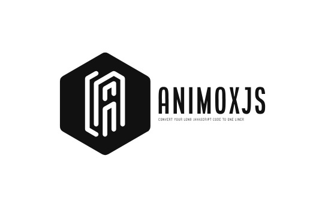

# Animox.js - Convert Your Long Javascript Code to One Liner 



Animox.js works like magic for frontend developers. Instead of spending lots of time writing complex code to create simple effects in web development, Animox.js condenses lengthy code into just a single line. This streamlines the development process, enabling developers to build better websites with less effort and time. This GitHub readme will walk you through the key aspects of using Animox.js in your web development journey.

## Table of Contents

- [Animox.js - Convert Your Long Javascript Code to One Liner](#animoxjs---convert-your-long-javascript-code-to-one-liner)
  - [Table of Contents](#table-of-contents)
  - [Introduction](#introduction)
  - [Installation](#installation)
  - [Getting Started](#getting-started)
    - [Required Libraries](#required-libraries)
  - [Mouse Follower](#mouse-follower)
  - [Magnet Effect](#magnet-effect)
  - [Text Effects](#text-effects)
  - [Sticky Navbar Effect](#sticky-navbar-effect)
  - [Scrolling](#scrolling)
  - [Text Split](#text-split)
  - [Scroll To Top](#scroll-to-top)
  - [Hover Effects](#hover-effects)
  - [OnHoverExpand Effect](#onhoverexpand-effect)
  - [Button Hover Effects](#button-hover-effects)
  - [Theme Toggler](#theme-toggler)
  - [ImageTrail Effect](#imagetrail-effect)
  - [InfiniteCarousel Effect](#infinitecarousel-effect)
  - [Image Slider Effect](#image-slider-effect)
  - [Updates](#updates)
  - [Inspiration](#inspiration)
  - [Demos](#demos)
  - [Contributing](#contributing)
  - [License](#license)

## Introduction

Animox.js simplifies the process of bringing everyday cool effects into your web applications. With Animox.js, developers can effortlessly incorporate these effects without the need for complex and time-consuming coding, enhancing the overall user experience.

## Installation

To use Animox.js in your project, you can include it in your HTML file via a CDN.

```html
<link rel="stylesheet" href="https://unpkg.com/animoxjs@1.0.0/dist/Animox.min.css">
```

```html
<script type="text/javascript" src="https://unpkg.com/animoxjs@1.0.0/dist/Animox.min.js"></script>
```

## Getting Started

Once you have included Animox.js in your project, you can start using its effects and functionalities. The library provides a straightforward API to make implementation easier.

```javascript
// Example code to initialize Animox.js and use the cool effects.
// use $ for queryselector and _ for queryselectorAll
$(".cursor").MouseFollower();
_(".container h1").TextEffect();
```

### Required Libraries

To successfully run with CDN, you'll need some libraries.

```html
<!--  Gsap is needed for Basic Effects -->
<script src="https://cdnjs.cloudflare.com/ajax/libs/gsap/3.12.2/gsap.min.js"></script>

<!-- Scroll Trigger is needed for Scroll Effects -->
<script src="https://cdnjs.cloudflare.com/ajax/libs/gsap/3.12.2/ScrollTrigger.min.js"></script>
```

## Mouse Follower

This feature creates smooth mouse follower, creating an engaging user experience, with different varities of mouse followers. it has total of Seven (7) Effects so please try it by yourself or refer our demo page for proper explanation

```javascript
$(".cursor").MouseFollower({
  //Parameters are optional.
  style: 2, //(1 to 7)
  bgColor: "royalBlue" // it is application for only style 2 --> ["#0000", "#ffff". "ETC"]
});
```
## Magnet Effect

The magnet mouse attractor effect draws elements towards the cursor, as if they are magnetically attracted, offering a unique and interactive experience.

```javascript
$(".box").Magnet({
  //Parameters are optional.
  style: 2, //(1 to 2)
  ease: "cubic-bezier(0.23, 1, 0.320, 1)",
  duration: 1,
});
```

## Text Effects

The text Effect animates text with cool animation , with many different animations.

```javascript
_(".container h1").TextEffect({
  //Parameters are optional.
  style: 3, //(1 to 9)
});
```

## Sticky Navbar Effect

This will help you to change your navbar color based on the scroll.

```javascript
$(".main").StickyNav({
    //parameters are optional
    style: 1 //(1 to 2)
})
```

## Scrolling

These helps in ease of including locomotive and scrollTrigger together and Lenis and Gsap together, using a single line of code.

```html
<!-- Add this files in same order for the proper working of the Animox library -->

<!-- for including locomotive and scrollTrigger along first include this libraries -->
<!-- Animox Js -->
<script type="text/javascript" src="https://unpkg.com/animoxjs@1.0.0/dist/AnimoxMinified.js"></script>

<!--  Locomotive is needed for Scrolling Effects -->
 <script src="https://cdn.jsdelivr.net/npm/locomotive-scroll@3.5.4/dist/locomotive-scroll.js"></script> 
<!--  Gsap is needed for Basic Effects -->
<script src="https://cdnjs.cloudflare.com/ajax/libs/gsap/3.12.2/gsap.min.js"></script>
<!-- Scroll Trigger is needed for Scroll Effects -->
<script src="https://cdnjs.cloudflare.com/ajax/libs/gsap/3.12.2/ScrollTrigger.min.js"></script>
```
```html
<!-- for including Lenis and Gsap along first include this libraries -->
<!-- Animox Js -->
<script type="text/javascript" src="https://unpkg.com/animoxjs@1.0.0/dist/AnimoxMinified.js"></script>

<!--  Gsap is needed for Basic Effects -->
<script src="https://cdnjs.cloudflare.com/ajax/libs/gsap/3.12.2/gsap.min.js"></script>
<!-- Scroll Trigger is needed for Scroll Effects -->
<script src="https://cdnjs.cloudflare.com/ajax/libs/gsap/3.12.2/ScrollTrigger.min.js"></script>
<!--  Lenis is needed for Scrolling Effects -->
<script src="https://unpkg.com/@studio-freight/lenis@1.0.34/dist/lenis.min.js"></script> 
```

```javascript
$(".main || selector").Scroll({
    //parameters are optional
    style: 1 //(1 to 3)
})
```

## Text Split

This feature helps in splitting the text into Single Character without using any other library. 

```html
<h1>
  This is a Demo text and this will be separated into each Character.
</h1>
```

```javascript
$("h1 || Enter an Element").TextSplit();
```
## Scroll To Top

This feature helps you to scroll to top of the website. 

```javascript
$(".scrollTop").ScrolltoTop({
    //parameters are optionals
    style: 1 //(1 to 2)
}
);
```
## Hover Effects

This feature helps you to add underline effects for the selected element. 

```javascript
_(".container h1").HoverEffect({
    //parameters are optionals
    style: 2, //(1 to 2)
    effect: "left" // it is only applicable for style two (i.e, center, right, bottom)
}
);
```
## OnHoverExpand Effect

This feature helps you to add onHover effects for the selected element. 

```javascript
$(".container .button").onHoverExpand( "Target-Element",{
  EbgColor: "#000",
  bgColor: "crimson",
  Ewidth: "250px"
}
);
```
## Button Hover Effects

This feature helps you to add Button Hover effects for the selected element. 

```javascript
$(".btn").BtnHover();
```
## Theme Toggler

This feature helps you to toggle from Dark Mode to Light Mode. 

```javascript
 // Initialize the ThemeToggler
  ThemeToggler.Mode({
    elements: ['body', '.navbar', '#element1', '#element2'],
    toggleButton: document.getElementById('toggleButton')   
  });
```
## ImageTrail Effect

This feature helps you to add Image trail effects for the selected element(it should be either body or a container). 

```javascript
$(".main").ImageTrail();

const images = [
    'Enter your pictures source or urls here',
    './imgs/people.jpg',
    'https://plus.unsplash.com/premium_photo-1703631159456-cd2437a37fbe?w=500&auto=format&fit=crop&q=60&ixlib=rb-4.0.3&ixid=M3wxMjA3fDB8MHxlZGl0b3JpYWwtZmVlZHwyMnx8fGVufDB8fHx8fA%3D%3D',
    'https://images.unsplash.com/photo-1707851621528-c50882570d7c?w=500&auto=format&fit=crop&q=60&ixlib=rb-4.0.3&ixid=M3wxMjA3fDB8MHxlZGl0b3JpYWwtZmVlZHwzNXx8fGVufDB8fHx8fA%3D%3D',
    'https://images.unsplash.com/photo-1669886912349-cb61c99e1186?w=500&auto=format&fit=crop&q=60&ixlib=rb-4.0.3&ixid=M3wxMjA3fDB8MHxlZGl0b3JpYWwtZmVlZHwzOXx8fGVufDB8fHx8fA%3D%3D',
    'https://plus.unsplash.com/premium_photo-1707227792423-def236793f48?w=500&auto=format&fit=crop&q=60&ixlib=rb-4.0.3&ixid=M3wxMjA3fDB8MHxlZGl0b3JpYWwtZmVlZHw0N3x8fGVufDB8fHx8fA%3D%3D',
    'https://images.unsplash.com/photo-1706354924653-eab4b40d7cc6?w=500&auto=format&fit=crop&q=60&ixlib=rb-4.0.3&ixid=M3wxMjA3fDB8MHxlZGl0b3JpYWwtZmVlZHw2MHx8fGVufDB8fHx8fA%3D%3D',
];
```
## InfiniteCarousel Effect

This feature helps you to add InfiniteCarousel effects for the selected element it makes that element infinite scrollable. 

```javascript
$(".container").InfiniteCarousel({
  style: 1 //(1 to 2)
}
);
```
## Image Slider Effect

This feature helps you to convert the selected element into Image Slider. it also contains an one line way to write the SwiperJs code

```javascript
$(".container").ImageSlider({
  style: 1 //(1 to 2)
  
  slideWidth: "30%"//style 2 is used to swiper js
  SwiperHeight: "80%",//these are used in style 2 only
}
);
```
## Updates

This library will be updated with many other features soon, so i hope you will share this library with your Developer friends.


## Inspiration

This library is inspired by Shery.js created by Sheryians 

Connect with him: [Harsh&#39;s Linkedin Profile](https://www.linkedin.com/in/harsh-sharma-924629147/)


## Demos

For detailed usage examples and demos of each effect, check out the [demos]([/examples/](https://github.com/Ssaj525/Animox.js.demos)) directory in the Animox.js repository.


Connect with me: satauheed.business@gmail.com

## Contributing

We welcome contributions from the community to enhance and expand [Animox.js](https://github.com/Ssaj525/Animox.js). If you encounter bugs, have feature suggestions, or want to contribute code, please check out our [contribution guidelines](contribution.md) for more information.

## License

Animox.js is released under the [MIT License](./licience.md). Feel free to use it in both personal and commercial projects.